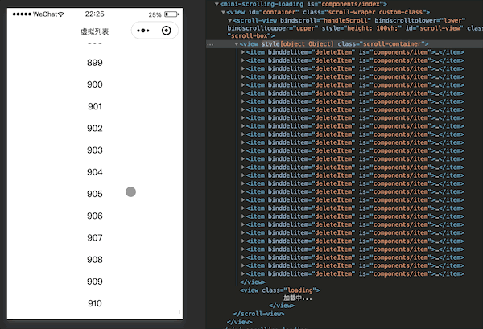

# mini-scrolling-loading

微信小程序滚动加载拓展组件，对官方方案进行了以下优化：

* 减少重复去写分页加载函数和分页逻辑
* 支持长列表虚拟渲染
* 优化删除子项无刷新交互


## 使用

1. 安装组件

```javascript
npm i mini-scrolling-loading --save
```

2. 在页面的 json 配置文件中添加 mini-scrolling-loading 自定义组件的配置

```javascript
{
  "usingComponents": {
    "mini-scrolling-loading": "mini-scrolling-loading/index",
    "scrolling-item": "/components/scroll-item/index"
  }
}
```
scrolling-item(组建名可自定义)组建为开发者自定义的列表单个item样式组建，mini-scrolling-loading采用抽象节点方式进行渲染，例如：
```javascript
<view class="scroll-view-item">{{item.title}}</view> 
```
.js
```javascript
Component({
    properties: {
        item: Object  // 变量名需使用item
    },
    methods: {
        delItem(e: { mark: { index: number}}) {
            const {index} = e.mark
            this.triggerEvent('delItem', index) // 如果有使用删除，在删除成功后，需派发delItem⌚️事件，传入删除的index索引即可，组建会无刷新更新列表。
        }
    }
})
```

3.WXML 文件中引用 mini-scrolling-loading

```javascript
<mini-scrolling-loading generic:item="scrolling-item" height="100vh" perpage="{{20}}" api="{{getData}}"></mini-scrolling-loading>
```


#### mini-scrolling-loading属性介绍

| 字段名 | 类型 | 必填 | 默认值 | 描述 |
| :---: | :---:| :---:| :---: | :---: |
| api | Function | 是 | - | API接口请求Promise函数 |
| page | Number | 否 | 1 | 分页|
| perpage | Number | 否 | 10 | 页码|
| perpageKey | String | 否 | perpage | 分页参数字段，例如pageSize |
| idKey | String | 是 | id | 能代表唯一标识的字段名 |
| query | Object | 否 | {} | 查询额外字段参数 |
| height | String | 是 | 300rpx | 可视容器高度 |
| itemHeight | number | 是 | 40 | 单个Item高度，单位px|
| enUpper | Boolean | 否 | false | 开启下拉刷新 |

## 虚拟列表原理图示


Demo


## 分页删除数据无刷新图示


