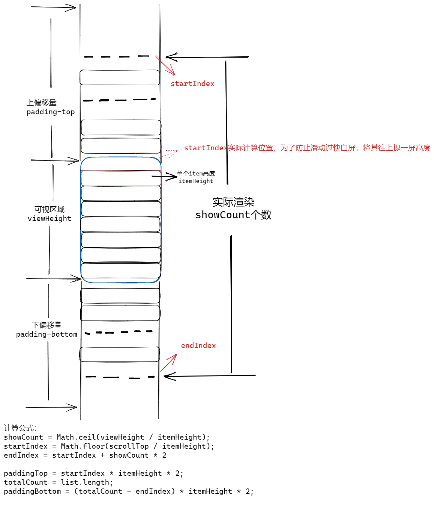
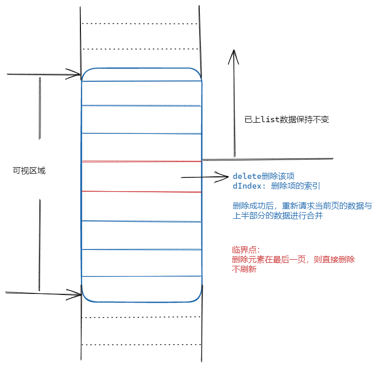

# mini-scrolling-loading

微信小程序滚动加载拓展组件，对官方方案进行了以下优化：

* 减少重复去写分页加载函数和分页逻辑
* 支持长列表虚拟渲染
* 优化删除子项无刷新交互

## 使用

1. 安装组件

```javascript
npm i mini-scrolling-loading --save
```

2. 在页面的 json 配置文件中添加 mini-scrolling-loading 自定义组件的配置

```javascript
{
  "usingComponents": {
    "mini-scrolling-loading": "mini-scrolling-loading/index"
  }
}
```

3.WXML 文件中引用 mini-scrolling-loading

```javascript
<mini-scrolling-loading generic:item="scrolling-item" height="100vh" perpage="{{20}}" api="{{getData}}"></mini-scrolling-loading>
```

#### mini-scrolling-loading属性介绍

| 字段名 | 类型 | 必填 | 默认值 | 描述 |
| :---: | :---:| :---:| :---: | :---: |
| api | Function | 是 | - | API接口请求函数 |

## 虚拟列表原理图示



## 分页删除数据无刷新图示


